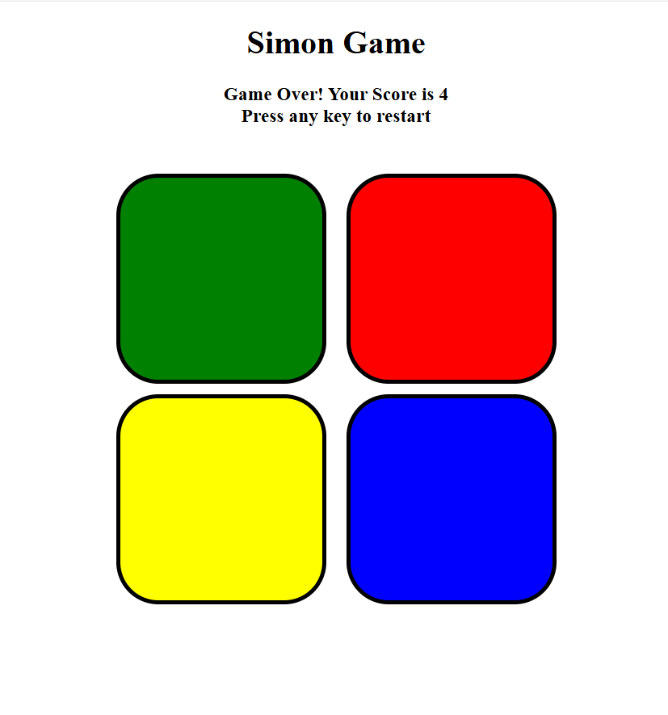

# 🎮 Simon Game

A fun memory-based game built using **HTML, CSS, and JavaScript**.  
Repeat the sequence of colors in the correct order. Each round adds a new step, testing your memory skills!

---

## 🚀 Live Demo
🔗 [Play the game here](https://simon-game-pc.netlify.app/)

---

## 📂 Repository
📦 [View on GitHub](https://github.com/likith2124/simon-game)

---

## 📸 Screenshot
  

---

## 🛠️ Tech Stack
- **HTML5**
- **CSS3**
- **JavaScript (ES6)**

---

## 🎯 Features
- 🧩 Randomly generated sequences every round.
- ⏯️ Start game with a single key press.
- 🚨 "Game Over" state with reset option.
- 🕹️ Interactive and fun memory challenge.

---

## 📂 Project Structure
simon-game/
├── index.html
├── style.css
├── app.js
└── README.md

---

## 🖥️ Run Locally
Clone the repo and open in browser:

```bash
git clone https://github.com/likith2124/simon-game.git
cd simon-game
open index.html
